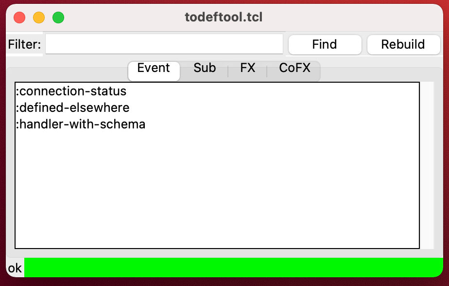

# todeftool

A tool for navigating [re-frame][] events, subscriptions and coeffects.

## Requirements

_Note: these are targeted for macOS._

You'll need Tcl/Tk installed - provides the UI toolkit. 

`reframe-tool` - [utility][reframe-tool] that does the actual work of indexing your ClojureScript code. You can install it with brew.

	brew tap rosado/rosado
	brew install reframe-tool

This will put `reframe-tool` on your path.

## Usage

	wish todeftool.tcl "cljs:/path/to/project/src" "cljs:/other/path/src"

You can supply multiple paths, as you can see. See `reframe-tool` usage for details about the pathspec.

You'll also need to edit `todeftool.tcl` to provide command for opening your editor. See the `openEditor` command.

The search box accepts Tcl regular expressions, so if you want to, for example, find subscriptions with "message" in the name you'll have to enter `*message*` into the text box.

The "Rebuild" button re-indexes your code.

## Known issues

If you're using Emacs (via `emacsclient`), it sometimes takes you to the right file+line on second click. I believe that's an Emacs issue, because I'm seeing it when using other tools. It's not a big deal but can be disorienting if you're not aware.

## License

The code is in Public Domain.

[re-frame]: https://day8.github.io/re-frame/
[reframe-tool]: https://github.com/rosado/reframe.nim